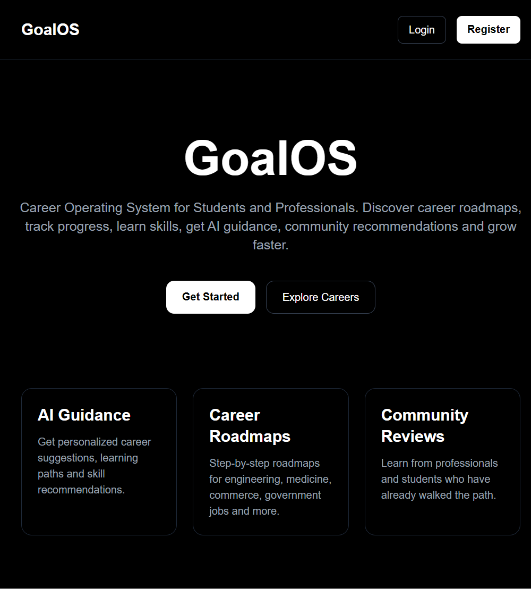
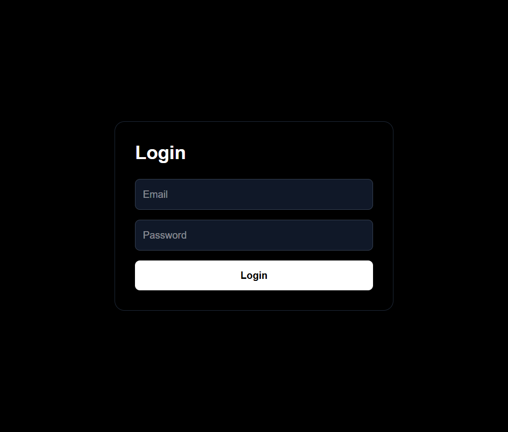
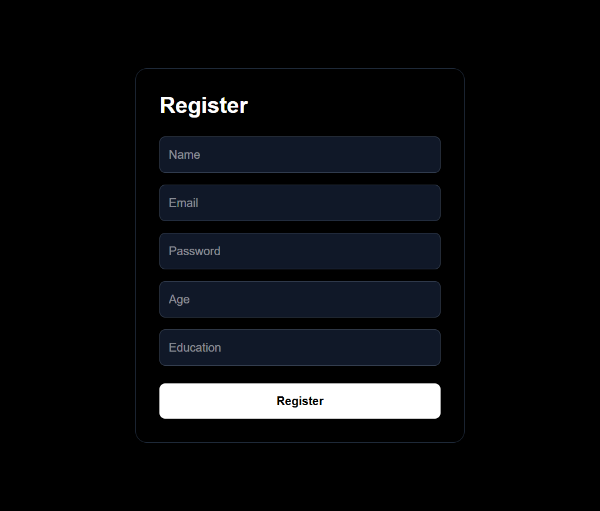
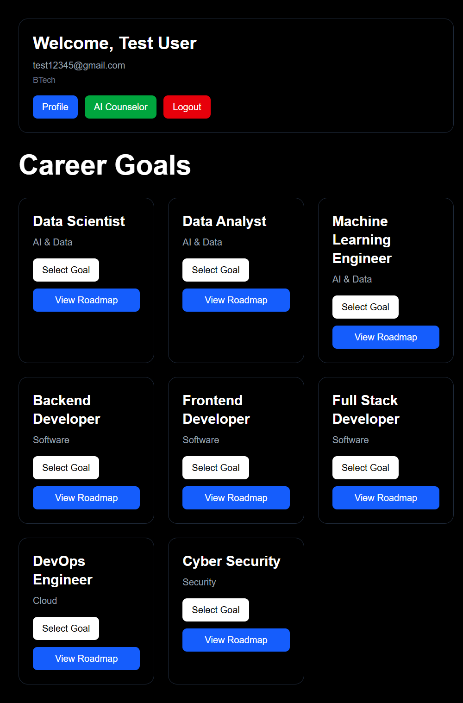
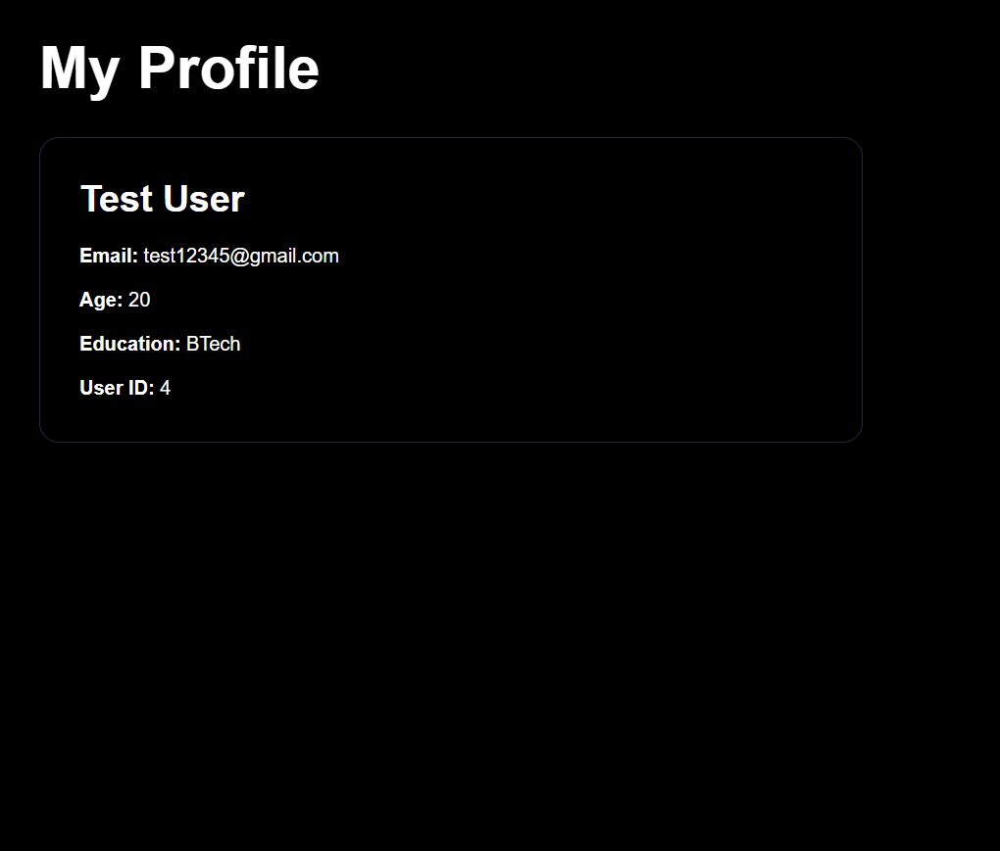
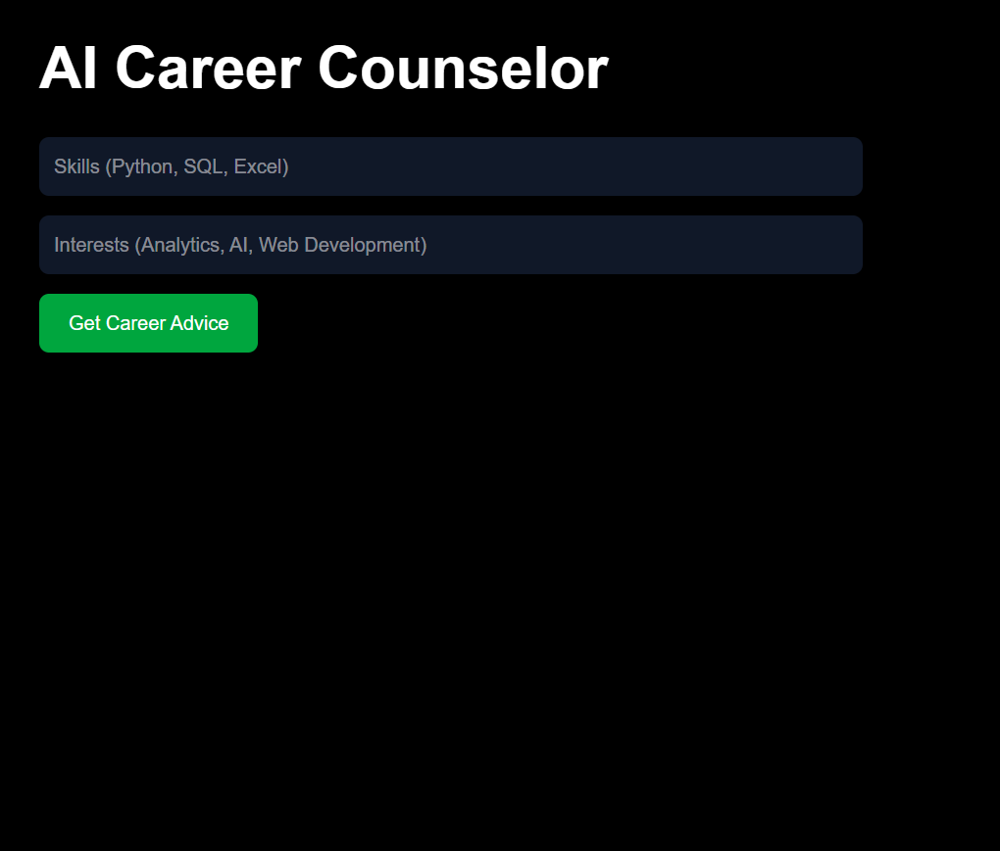
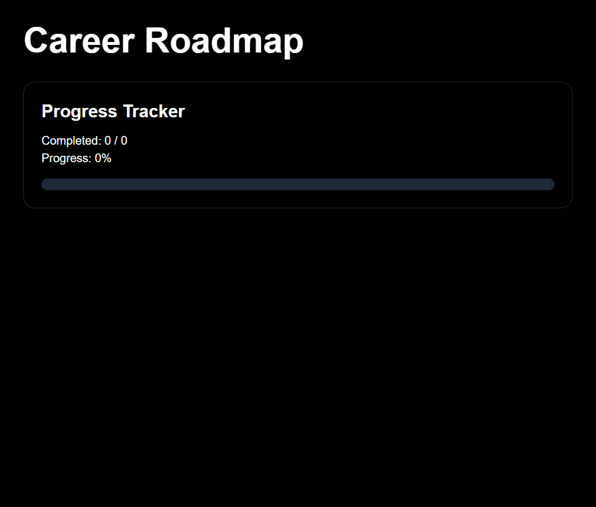
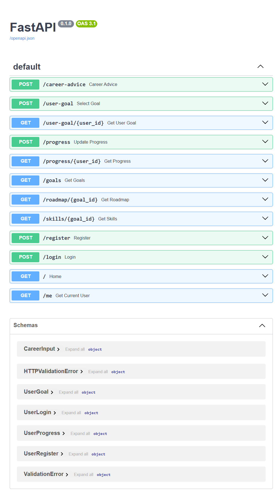

# 🚀 GoalOS – AI Career Operating System

<p align="center">


</p>

An AI-powered Career Operating System that helps students discover career paths, follow structured learning roadmaps, track their progress, and receive personalized career guidance.

---

# 🌐 Live Demo

### Frontend

https://goal-os-dusky.vercel.app

### Backend API

https://goalos-backend.onrender.com

### API Documentation

https://goalos-backend.onrender.com/docs

---

# 📖 Overview

GoalOS is a full-stack AI-powered career guidance platform designed to help students and professionals discover career paths, follow structured learning roadmaps, and monitor their learning journey.

The platform provides secure authentication, personalized dashboards, career roadmaps, progress tracking, and AI-powered career assistance.

---

# ✨ Features

## 🔐 Authentication

- User Registration
- User Login
- JWT Authentication
- Secure User Sessions

## 🎯 Career Goals

- Browse Career Domains
- Select Career Goals
- Personalized Dashboard

## 🗺️ Career Roadmaps

- Step-by-step Learning Paths
- Skill Progression
- Career Milestones

## 📊 Progress Tracking

- Track Completed Steps
- Learning Progress
- Continue Learning Journey

## 👤 User Profile

- User Information
- Education Details
- Selected Career Goal

## 🤖 AI Career Counselor

- AI-powered Career Guidance
- Personalized Suggestions
- Learning Recommendations

---

# 🛠 Tech Stack

## Frontend

- Next.js
- React
- TypeScript
- Tailwind CSS

## Backend

- FastAPI
- Python
- SQLAlchemy
- JWT Authentication
- Passlib (bcrypt)

## Database

- PostgreSQL
- Supabase

## Deployment

- Vercel
- Render

## Version Control

- Git
- GitHub

---

# 🏗 Architecture

```text
Next.js Frontend
        │
        ▼
 FastAPI Backend
        │
        ▼
 PostgreSQL (Supabase)
```

---

# 📂 Project Structure

```text
GoalOS
│
├── backend
│   ├── routers
│   ├── schemas
│   ├── database.py
│   └── main.py
│
├── goalos-frontend
│   ├── src
│   │   ├── app
│   │   ├── login
│   │   ├── register
│   │   ├── dashboard
│   │   ├── profile
│   │   ├── roadmap
│   │   └── career-ai
│
├── assets
│   └── screenshots
│
└── README.md
```

---

# 🗄 Database Tables

- users
- goals
- user_goals
- roadmap_nodes
- skills
- goal_skills
- user_progress

---

# 📡 API Endpoints

## Authentication

- POST /register
- POST /login

## User

- GET /me

## Goals

- GET /goals

## Roadmap

- GET /roadmap/{goal_id}

## Skills

- GET /skills/{goal_id}

## User Goals

- POST /user-goal
- GET /user-goal/{user_id}

## Progress

- POST /progress
- GET /progress/{user_id}

---

# 📸 Screenshots

## 🏠 Landing Page



---

## 🔐 Login Page



---

## 📝 Register Page



---

## 📊 Dashboard



---

## 👤 Profile Page



---

## 🤖 AI Career Counselor



---

## 🗺️ Career Roadmap



---

## 📡 Backend API Documentation



---

# 🚀 Installation

## Clone Repository

```bash
git clone https://github.com/vanshsoni4/GoalOS.git
```

## Backend

```bash
cd backend

pip install -r requirements.txt

uvicorn main:app --reload
```

## Frontend

```bash
cd goalos-frontend

npm install

npm run dev
```

---

# 🔮 Future Improvements

- AI Career Counselor
- Skill Gap Analysis
- Resume Analyzer
- Internship Recommendation System
- Community Reviews
- Mentor Verification
- Learning Analytics
- Interview Preparation

---

# 👨‍💻 Author

**Vansh Soni**

B.Tech Computer Science with Data Science

JC Bose University of Science and Technology

GitHub:
https://github.com/vanshsoni4

---

# ⭐ Show Your Support

If you like this project, consider giving it a ⭐ on GitHub.
